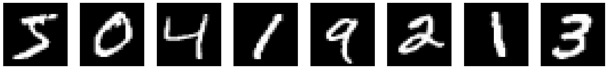

## Testing the effects of sparsity on the memory capacity of a recurrent neural network. 
This is a small inquiry motivated by the connectivity structure of the hippocampus - high inter-regional connectivity means CA3 is usually modelled as a fully-connected RNN. However, inputs to CA3 from mossy fiber synapses in the dentate gyrus are extremely sparse. Perhaps that could be a mechanism for increasing storage capacity in CA3? I looked at two biologically-motived methods for sparsity:

The original, unprocessed input is a series of MNIST digits:

Here are what they look like after two different (biologically-plausible) sparsification methods:

K-winner-takes-all sparsity: (also used in Dasgupta, et.al 2017)

Antihebbian learning: (Földiák 1990)

(Both methods were tuned such that the outputs have approximately equal sparsity)

As you probably guessed, sparsity does increase the capacity of the network:

Antihebbian sparsity seemed to perform better than threshold-based sparsity, probably because it specifically decorrelated the input activation pattern, though more work would need to be done to formally show that.
